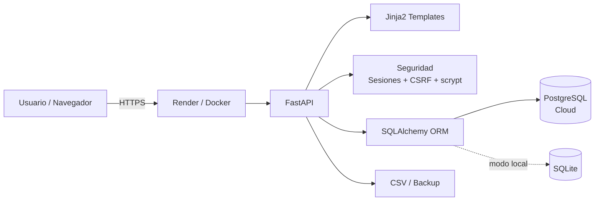

# ZAFIRAH Gestión

<p align="center">
  
</p>

<p align="center">
  <strong>Sistema web de gestión integral para un emprendimiento real de jabones artesanales y velas aromáticas.</strong>
</p>

<p align="center">
  Stock · Compras · Producción · Recetas/BOM · Ventas · Costos · Gastos · Rentabilidad · Auditoría
</p>

<p align="center">
  
  
  
  
  
  
</p>

## Demo

**Aplicación en producción:** [zafirah-gestion-cloud.onrender.com](https://zafirah-gestion-cloud.onrender.com)

> La instancia productiva requiere autenticación. No se publican credenciales ni datos reales del negocio.

## Sobre el proyecto

ZAFIRAH Gestión nació para resolver necesidades operativas concretas de un emprendimiento: conocer el stock disponible, registrar compras y ventas, controlar materias primas, producir a partir de recetas, calcular costos y medir la rentabilidad real.

El sistema modela el flujo completo desde la compra de insumos hasta la venta del producto terminado, manteniendo trazabilidad de los movimientos de inventario y evitando inconsistencias contables frecuentes, como duplicar el costo de la materia prima como gasto operativo.

### Problemas que resuelve

- Centraliza datos que normalmente quedarían dispersos en planillas o registros manuales.
- Controla stock de productos terminados e insumos.
- Automatiza consumos de materias primas durante la producción.
- Calcula costo por lote y costo unitario.
- Congela el costo de mercadería vendida (COGS) al momento de la venta.
- Mide ganancia bruta y ganancia neta.
- Mantiene historial y auditoría de movimientos de inventario.
- Permite revertir operaciones sin perder trazabilidad.
- Funciona tanto localmente como en la nube.

## Funcionalidades principales

| Módulo | Funcionalidad |
|---|---|
| **Dashboard** | Ventas, ganancia bruta, gastos, ganancia neta, alertas de stock y actividad reciente |
| **Productos** | SKU, categoría, costo, precio, stock mínimo, activación y borrado seguro |
| **Insumos** | Stock, unidad de medida, costo promedio y alertas de reposición |
| **Recetas / BOM** | Composición de cada producto y cantidades de materias primas |
| **Compras** | Carga multiítem, actualización de stock y recálculo de costo promedio |
| **Producción** | Descuento automático de insumos, costo del lote y aumento de producto terminado |
| **Ventas** | Control de stock, COGS, margen y rentabilidad por operación |
| **Gastos** | Registro de gastos operativos |
| **Contactos** | Gestión de proveedores y clientes |
| **Informes** | Resultados por rango de fechas y rentabilidad por producto |
| **Auditoría** | Registro de todos los movimientos de inventario |
| **Reversiones** | Anulación de compras, ventas y producciones con restitución de stock |
| **Exportación** | Ventas y stock en CSV |
| **Backup** | Exportación de la base completa |
| **PWA** | Interfaz responsive e instalable en dispositivos móviles |

## Stack tecnológico

### Backend
- **Python 3.12**
- **FastAPI**
- **SQLAlchemy 2**
- **Jinja2**
- **Starlette Sessions**
- **psycopg 3**

### Base de datos
- **SQLite** para ejecución local.
- **PostgreSQL** para despliegue cloud.
- Compatible con proveedores PostgreSQL como **Supabase**.

### Frontend
- HTML renderizado en servidor con **Jinja2**.
- CSS responsive propio.
- Progressive Web App mediante manifest y service worker.

### Infraestructura
- **Docker**
- **Render**
- Variables de entorno para credenciales y configuración sensible.

## Arquitectura



La aplicación utiliza una arquitectura server-rendered sencilla: FastAPI gestiona rutas, reglas de negocio y seguridad; SQLAlchemy abstrae persistencia; Jinja2 genera las vistas; y la base de datos cambia entre SQLite y PostgreSQL según la configuración del entorno.

## Lógica de inventario y costos

Uno de los puntos centrales del proyecto es mantener coherencia entre producción, stock y rentabilidad.

### Compras
Al registrar una compra:

1. aumenta el stock del insumo;
2. se registra el movimiento de inventario;
3. se recalcula el costo promedio del material.

### Producción
Al producir:

1. se consultan los componentes de la receta;
2. se valida la disponibilidad de insumos;
3. se descuentan las materias primas;
4. se calcula el costo total del lote;
5. se obtiene el costo unitario;
6. aumenta el stock del producto terminado.

### Ventas
Al vender:

1. se valida el stock disponible;
2. se descuenta el producto;
3. se congela el costo unitario vigente;
4. se calcula el **COGS**;
5. se obtiene la ganancia de la operación.

### Resultado

- **Ventas** = ingresos por ventas activas.
- **COGS** = cantidad vendida × costo unitario congelado al vender.
- **Ganancia bruta** = ventas − COGS.
- **Ganancia neta** = ganancia bruta − gastos operativos.

Las compras de materias primas no se descuentan nuevamente como gasto operativo porque su costo se incorpora al producto durante la producción y pasa a COGS cuando se vende.

## Seguridad

El sistema implementa varias medidas básicas para una aplicación administrativa:

- contraseñas almacenadas mediante **scrypt** con sal aleatoria;
- protección **CSRF** en formularios;
- sesiones firmadas;
- cookies seguras en producción;
- secretos obtenidos desde variables de entorno;
- separación entre código fuente y base de datos;
- borrado de productos protegido por validaciones de integridad;
- prevención de eliminación cuando existen dependencias en ventas, producción o recetas.

Los archivos de base de datos local y secretos de sesión están excluidos del repositorio mediante `.gitignore`.

## Ejecución local

### Requisitos

- Python 3.11 o superior.
- Git opcional si se clona el repositorio.

### Windows

Clonar el proyecto:

```bash
git clone https://github.com/eduardofloress9402-a11y/zafirah-gestion-cloud.git
cd zafirah-gestion-cloud
```

Luego ejecutar:

```text
INICIAR_ZAFIRAH.bat
```

El script crea el entorno virtual, instala las dependencias y levanta el servidor.

Abrir:

```text
http://127.0.0.1:8000
```

En modo local, la base se almacena en:

```text
data/zafirah.db
```

## Ejecución manual

```bash
python -m venv .venv
```

Activar el entorno e instalar dependencias:

```bash
pip install -r requirements.txt
```

Levantar el servidor:

```bash
python -m uvicorn app.main:app --host 0.0.0.0 --port 8000
```

## Configuración cloud

Variables de entorno utilizadas:

| Variable | Uso |
|---|---|
| `DATABASE_URL` | Conexión PostgreSQL |
| `ZAFIRAH_SECRET` | Firma de sesiones |
| `COOKIE_SECURE` | Obliga cookies HTTPS cuando vale `1` |

El repositorio incluye `Dockerfile` y `render.yaml` para facilitar el despliegue.

## Estructura del proyecto

```text
zafirah-gestion-cloud/
├── app/
│   ├── main.py
│   ├── database.py
│   ├── models.py
│   ├── security.py
│   ├── seed.py
│   ├── static/
│   │   ├── app.css
│   │   ├── manifest.json
│   │   └── sw.js
│   └── templates/
├── Dockerfile
├── render.yaml
├── requirements.txt
├── INICIAR_ZAFIRAH.bat
└── README.md
```

## Decisiones de diseño

- **Server-side rendering:** reduce complejidad para un sistema administrativo de uso interno.
- **SQLAlchemy ORM:** permite mantener la misma lógica de aplicación con SQLite y PostgreSQL.
- **Registro explícito de movimientos:** facilita auditoría y reconstrucción del historial de stock.
- **COGS congelado en la venta:** evita que modificaciones futuras de costos alteren resultados históricos.
- **Operaciones reversibles:** las anulaciones restituyen stock en lugar de borrar el historial comercial.
- **Dockerización:** simplifica el despliegue reproducible en cloud.

## Evolución prevista

Algunas mejoras posibles para próximas versiones:

- pruebas automatizadas;
- roles y permisos por usuario;
- API REST separada del frontend;
- búsqueda y filtrado avanzado;
- paneles analíticos adicionales;
- mayor cobertura de auditoría;
- entorno público de demostración con datos ficticios;
- integración con canales de venta y facturación.

## Portfolio

Este proyecto muestra la aplicación práctica de:

- análisis de un proceso de negocio real;
- modelado de datos relacional;
- reglas de inventario y costos;
- diseño de operaciones transaccionales;
- desarrollo backend con FastAPI;
- autenticación y seguridad web;
- frontend responsive;
- Docker y despliegue cloud;
- mantenimiento evolutivo mediante Git y pull requests.

## Autor / repositorio

**Eduardo Flores**

GitHub: [@eduardofloress9402-a11y](https://github.com/eduardofloress9402-a11y)

---

**ZAFIRAH Gestión** es un proyecto en evolución utilizado como herramienta de gestión para un emprendimiento real.
